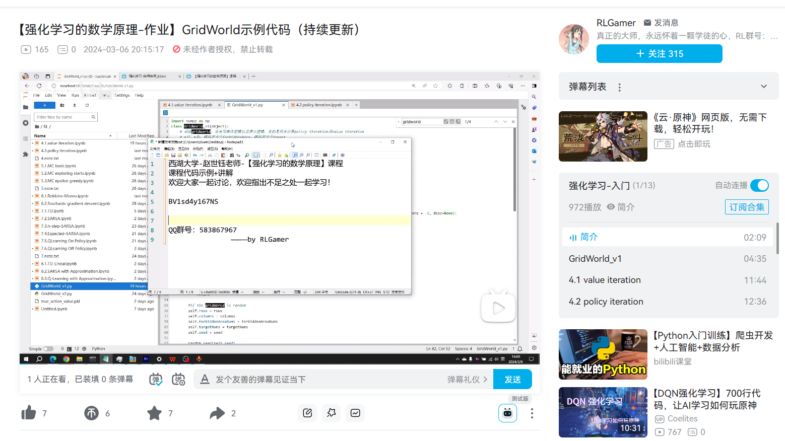
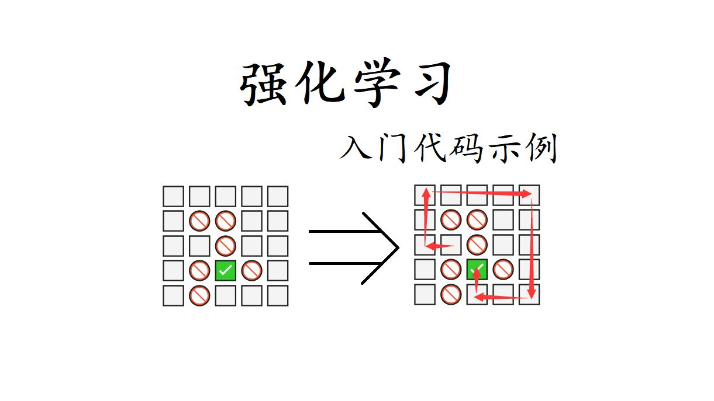

### 前言

> 这是一个基于emoji可视化的网格世界（gridworld）强化学习示例代码，目前已完成至第七章
>
> 并且同步附有bilibili网站的视频代码讲解，欢迎各位同学参与到讨论学习当中
>
> 欢迎各位同学加群一起讨论583867967（已有335人）6.19是158人 5.13是107人  3.15是22人

项目对应B站链接：https://www.bilibili.com/video/BV1fW421w7NH

该项目为西湖大学赵世钰老师的课程学习代码

课程的B站链接：[【强化学习的数学原理】课程：从零开始到透彻理解（完结）_哔哩哔哩_bilibili](https://www.bilibili.com/video/BV1sd4y167NS)

课程的Github项目：[MathFoundationRL/Book-Mathematical-Foundation-of-Reinforcement-Learning: This is the homepage of a new book entitled "Mathematical Foundations of Reinforcement Learning." (github.com)](https://github.com/MathFoundationRL/Book-Mathematical-Foundation-of-Reinforcement-Learning)

#### 24.2.29 更
目前该代码只完成到前7课，正在编码第8课值函数近似。预计未来一到两周内学完。届时在B站中将发一个视频进行代码介绍。

#### 24.3.15 更
B站视频已更新到第七章，第八章真的坑，天坑，这一章的代码我写了近一个月都收敛不了。
停更一段时间，一方面要准备考研复试，换个思路攻克一下第八章DQN不收敛的难题。

#### 24.5.16 更
考研已上岸，B站视频已更新到第八章，准备开始第九章的学习，争取一周内攻克第九章第十章

#### 24.6.19 更

已更Reinforce，下个月更PPO

#### 24.11.23 更
最近好忙，囤积了很多东西都没来得及更新，先上传两份调教好的代码，一份是Reinforce 去攻克gridworld，一份是PPO攻克gridworld